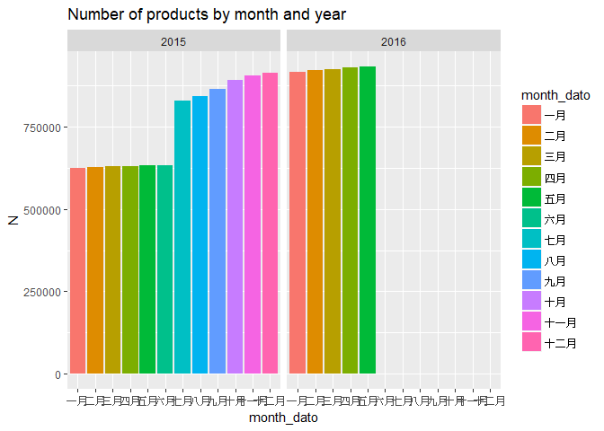
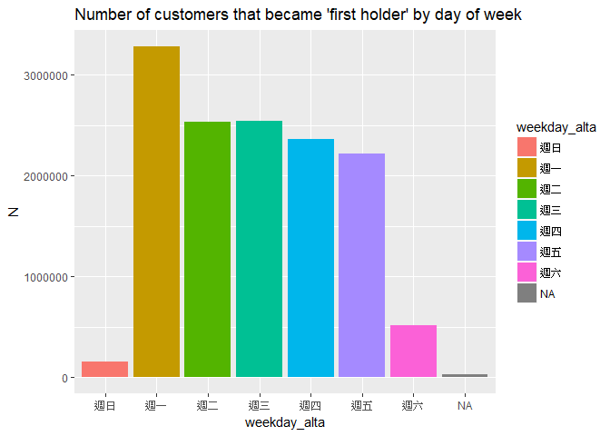
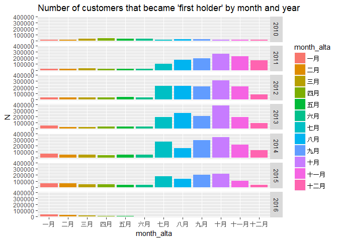
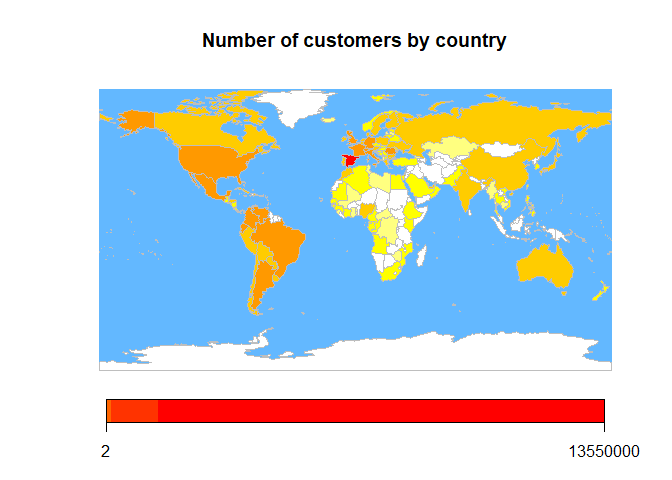
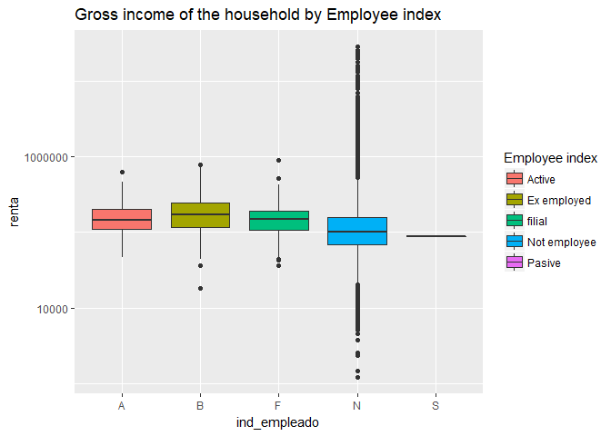
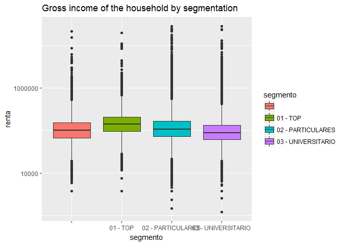
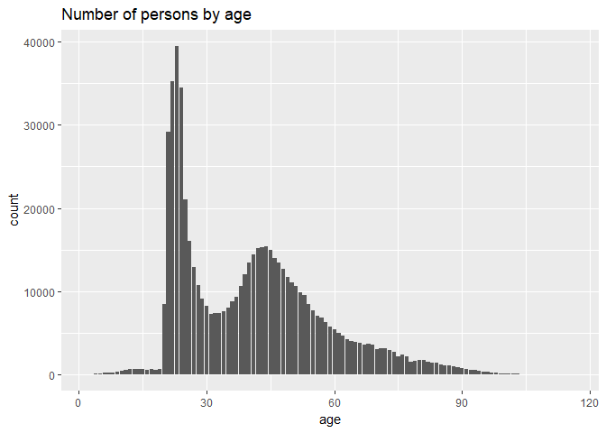

Hi
================

``` r
library(data.table)
library(ggplot2)
library(lubridate)
library(magrittr)
library(ggplot2)
```

### selectrow:定義篩選變數

### select = selectrow 篩選變數 showProgress = F 不顯示讀取進度

``` r
selectrow <- c("fecha_dato","fecha_alta","pais_residencia") 
train <- fread("D:/data/train_ver2.csv",select = selectrow,showProgress =F) 
```

``` r
train %>% head
```

    ##    fecha_dato fecha_alta pais_residencia
    ## 1: 2015-01-28 2015-01-12              ES
    ## 2: 2015-01-28 2012-08-10              ES
    ## 3: 2015-01-28 2012-08-10              ES
    ## 4: 2015-01-28 2012-08-10              ES
    ## 5: 2015-01-28 2012-08-10              ES
    ## 6: 2015-01-28 2012-08-10              ES

``` r
# 轉換成日期格式
train$fecha_dato <- ymd(train$fecha_dato) 
train$fecha_alta <- ymd(train$fecha_alta)
# 增加年份
train$year_dato <- year(train$fecha_dato) 
train$year_alta <- year(train$fecha_alta)
# 增加月份
train$month_dato <- month(train$fecha_dato,label=T) 
train$month_alta <- month(train$fecha_alta,label=T)
# 增加週
train$weekday_alta <- wday(train$fecha_alta,label=T)
# 將data.frame 轉換成data.table格式
train<-as.data.table(train)
train %>% head
```

    ##    fecha_dato fecha_alta pais_residencia year_dato year_alta month_dato
    ## 1: 2015-01-28 2015-01-12              ES      2015      2015       一月
    ## 2: 2015-01-28 2012-08-10              ES      2015      2012       一月
    ## 3: 2015-01-28 2012-08-10              ES      2015      2012       一月
    ## 4: 2015-01-28 2012-08-10              ES      2015      2012       一月
    ## 5: 2015-01-28 2012-08-10              ES      2015      2012       一月
    ## 6: 2015-01-28 2012-08-10              ES      2015      2012       一月
    ##    month_alta weekday_alta
    ## 1:       一月         週一
    ## 2:       八月         週五
    ## 3:       八月         週五
    ## 4:       八月         週五
    ## 5:       八月         週五
    ## 6:       八月         週五

### 取消科學符號

``` r
options(scipen=999)
```

### 每年每月所擁有的產品

### fecha\_alta 成為客戶的時間

``` r
ggplot(train[,.N,by=.(month_dato,year_dato)],aes(x = month_dato,y=N,fill=month_dato))+
  geom_bar(stat="identity")+ggtitle("Number of products by month and year")+
  facet_wrap(~year_dato)
```



### 以weekday\_alta分組計算

``` r
train[,.N,by=weekday_alta]
```

    ##    weekday_alta       N
    ## 1:         週一 3285816
    ## 2:         週五 2222629
    ## 3:           NA   27734
    ## 4:         週四 2361292
    ## 5:         週二 2535325
    ## 6:         週三 2546352
    ## 7:         週日  153193
    ## 8:         週六  514968

``` r
ggplot(train[,.N,by=weekday_alta],aes(x = weekday_alta,y = N,fill=weekday_alta))+
  geom_bar(stat="identity")+ggtitle("Number of customers that became 'first holder' by day of week")
```



### 抓取year\_alta&gt;2014年後的資料，並以month\_alta、weekday\_alta分組計算

``` r
ggplot(train[year_alta>2009,.N,by=.(month_alta,year_alta)],aes(x = month_alta,y=N,fill=month_alta))+
  geom_bar(stat="identity")+ggtitle("Number of customers that became 'first holder' by month and year")+
  facet_grid(year_alta~.)
```



### 畫出顧客所在位置

``` r
library(rworldmap)
```

    ## Loading required package: sp

    ## ### Welcome to rworldmap ###

    ## For a short introduction type :   vignette('rworldmap')

``` r
pais <- train[,.N,by=pais_residencia] # Number of customers by country

fr <- joinCountryData2Map(dF = pais,joinCode = "ISO2",nameJoinColumn = "pais_residencia",verbose=F) # Prepare data to plot
```

    ## 117 codes from your data successfully matched countries in the map
    ## 2 codes from your data failed to match with a country code in the map
    ## 125 codes from the map weren't represented in your data

``` r
mapCountryData(mapToPlot = fr,nameColumnToPlot = "N",catMethod = "logFixedWidth",
               oceanCol = "steelblue1",missingCountryCol = "white",
               mapTitle = "Number of customers by country",
               aspect = "variable") # Plot Worlmap
```



``` r
rm(list = ls())
selectrow <- c("ind_empleado","renta")
train <- fread("D:/data/train_ver2.csv",select = selectrow,showProgress = F)
train <- train[!is.na(train$renta)]
ggplot(train,aes(x = ind_empleado,y = renta,fill=ind_empleado))+
  ggtitle("Gross income of the household by Employee index")+
  geom_boxplot(na.rm=TRUE)+scale_y_log10()+
  scale_fill_discrete(name = "Employee index",labels = c("Active", "Ex employed","filial","Not employee","Pasive"))
```



``` r
rm(list = ls())
selectrow <- c("segmento","renta")
train <- fread("D:/data/train_ver2.csv",select = selectrow,showProgress = F)
train <- train[!is.na(train$renta)]
ggplot(train,aes(x = segmento,y = renta,fill=segmento))+
  ggtitle("Gross income of the household by segmentation")+
  geom_boxplot(na.rm=TRUE)+scale_y_log10()
```



``` r
rm(list = ls())
selectrow <- c("segmento","renta")
train <- fread("D:/data/train_ver2.csv",select = selectrow,showProgress = F)
train <- train[!is.na(train$renta)]
t.test(x = train[segmento=="02 - PARTICULARES",renta],y =train[segmento=="03 - UNIVERSITARIO",renta],alternative = "greater")
```

    ## 
    ##  Welch Two Sample t-test
    ## 
    ## data:  train[segmento == "02 - PARTICULARES", renta] and train[segmento == "03 - UNIVERSITARIO", renta]
    ## t = 185.65, df = 9961200, p-value < 0.00000000000000022
    ## alternative hypothesis: true difference in means is greater than 0
    ## 95 percent confidence interval:
    ##  24904   Inf
    ## sample estimates:
    ## mean of x mean of y 
    ##  141558.2  116431.6

``` r
rm(list = ls())
selectrow <- c("age","ncodpers")
train <- fread("D:/data/train_ver2.csv",select = selectrow,nrows = 1000000,showProgress = F)
ggplot(train[age<118,.("age"=mean(age,na.rm = T)),by=ncodpers],aes(age))+
  stat_count()+ggtitle("Number of persons by age") 
```



``` r
summary(train[,age])
```

    ##    Min. 1st Qu.  Median    Mean 3rd Qu.    Max.    NA's 
    ##    2.00   27.00   43.00   43.27   53.00  116.00   10782
