Detailed Data Cleaning/Visualization
================

這份資料為西班牙Santander銀行的客戶樣態模擬資料，包含1.5年(2015-01-28 ~ 2016-05-28)的客戶基本資訊以及產品持有狀態，各欄位說明請見[資料描述](https://www.kaggle.com/c/santander-product-recommendation/data)。 我們的分析目標是根據這份資料，預測每個客戶在2016-06-28的時候，除了現已持有的商品外，還會購買哪些產品？

首先載入相關資料處理套件。

``` r
library(data.table)
library(dplyr)
library(tidyr)
library(lubridate)
library(ggplot2)
```

### ggplot2 Theme Trick

ggplot2是R軟體很夯的一個繪圖套件，主要是運用了繪圖文法(Grammar of Graphics)的概念，有相當的彈性。

這邊作者用了一個小技巧，將theme層的設定先另行儲存起來，後續繪製圖形的時候就可以直接套用自訂版型，而不需要每次都寫一長串語法。

``` r
my_theme <- theme_bw() +
  theme(axis.title=element_text(size=24),
        plot.title=element_text(size=36),
        axis.text =element_text(size=16))

my_theme_dark <- theme_dark() +
  theme(axis.title=element_text(size=24),
        plot.title=element_text(size=36),
        axis.text =element_text(size=16))
```

First Glance
------------

fread是data.table套件中讀取外部文字檔的函數，效率蠻高的，適合用在大型資料上。

``` r
set.seed(1)
df <- fread("~/data/kaggle/santander/train_ver2.csv", nrows=-1)
```

    ## 
    Read 0.0% of 13647309 rows
    Read 7.3% of 13647309 rows
    Read 14.6% of 13647309 rows
    Read 21.9% of 13647309 rows
    Read 27.8% of 13647309 rows
    Read 35.5% of 13647309 rows
    Read 43.0% of 13647309 rows
    Read 50.6% of 13647309 rows
    Read 58.3% of 13647309 rows
    Read 65.9% of 13647309 rows
    Read 73.5% of 13647309 rows
    Read 81.2% of 13647309 rows
    Read 88.8% of 13647309 rows
    Read 96.4% of 13647309 rows
    Read 13647309 rows and 48 (of 48) columns from 2.135 GB file in 00:00:18

為了避免記憶體不夠用，作者針對客戶id隨機抽了35萬個客戶出來作示範，實際上真的在實作的時候是不需要做這個步驟的。

``` r
unique.id <- unique(df$ncodpers)
limit.people <- 3.5e5
unique.id <- unique.id[sample(length(unique.id),limit.people)]
df <- df[df$ncodpers %in% unique.id,]
str(df)
```

    ## Classes 'data.table' and 'data.frame':   4994929 obs. of  48 variables:
    ##  $ fecha_dato           : chr  "2015-01-28" "2015-01-28" "2015-01-28" "2015-01-28" ...
    ##  $ ncodpers             : int  1050612 1050613 1050616 1050617 1050621 1050622 1050623 1050610 1050627 1050592 ...
    ##  $ ind_empleado         : chr  "N" "N" "N" "N" ...
    ##  $ pais_residencia      : chr  "ES" "ES" "ES" "ES" ...
    ##  $ sexo                 : chr  "V" "H" "H" "H" ...
    ##  $ age                  : int  23 22 23 23 23 23 23 24 23 22 ...
    ##  $ fecha_alta           : chr  "2012-08-10" "2012-08-10" "2012-08-10" "2012-08-10" ...
    ##  $ ind_nuevo            : int  0 0 0 0 0 0 0 0 0 0 ...
    ##  $ antiguedad           : int  35 35 35 35 35 35 35 35 35 35 ...
    ##  $ indrel               : int  1 1 1 1 1 1 1 1 1 1 ...
    ##  $ ult_fec_cli_1t       : chr  "" "" "" "" ...
    ##  $ indrel_1mes          : chr  "1" "1" "1" "1" ...
    ##  $ tiprel_1mes          : chr  "I" "I" "I" "A" ...
    ##  $ indresi              : chr  "S" "S" "S" "S" ...
    ##  $ indext               : chr  "N" "N" "N" "N" ...
    ##  $ conyuemp             : chr  "" "" "" "" ...
    ##  $ canal_entrada        : chr  "KHE" "KHD" "KHE" "KHE" ...
    ##  $ indfall              : chr  "N" "N" "N" "N" ...
    ##  $ tipodom              : int  1 1 1 1 1 1 1 1 1 1 ...
    ##  $ cod_prov             : int  13 50 24 50 50 17 49 37 13 31 ...
    ##  $ nomprov              : chr  "CIUDAD REAL" "ZARAGOZA" "LEON" "ZARAGOZA" ...
    ##  $ ind_actividad_cliente: int  0 0 0 1 0 0 1 1 0 0 ...
    ##  $ renta                : num  122179 119776 295590 113317 72576 ...
    ##  $ segmento             : chr  "03 - UNIVERSITARIO" "03 - UNIVERSITARIO" "03 - UNIVERSITARIO" "03 - UNIVERSITARIO" ...
    ##  $ ind_ahor_fin_ult1    : int  0 0 0 0 0 0 0 0 0 0 ...
    ##  $ ind_aval_fin_ult1    : int  0 0 0 0 0 0 0 0 0 0 ...
    ##  $ ind_cco_fin_ult1     : int  1 0 1 1 1 1 1 1 1 1 ...
    ##  $ ind_cder_fin_ult1    : int  0 0 0 0 0 0 0 0 0 0 ...
    ##  $ ind_cno_fin_ult1     : int  0 0 0 0 0 0 0 0 0 0 ...
    ##  $ ind_ctju_fin_ult1    : int  0 0 0 0 0 0 0 0 0 0 ...
    ##  $ ind_ctma_fin_ult1    : int  0 0 0 0 0 0 0 0 0 0 ...
    ##  $ ind_ctop_fin_ult1    : int  0 0 0 0 0 0 0 0 0 0 ...
    ##  $ ind_ctpp_fin_ult1    : int  0 0 0 0 0 0 0 0 0 0 ...
    ##  $ ind_deco_fin_ult1    : int  0 1 0 0 0 0 0 0 0 0 ...
    ##  $ ind_deme_fin_ult1    : int  0 0 0 0 0 0 0 0 0 0 ...
    ##  $ ind_dela_fin_ult1    : int  0 0 0 0 0 0 0 0 0 0 ...
    ##  $ ind_ecue_fin_ult1    : int  0 0 0 0 0 0 0 0 0 0 ...
    ##  $ ind_fond_fin_ult1    : int  0 0 0 0 0 0 0 0 0 0 ...
    ##  $ ind_hip_fin_ult1     : int  0 0 0 0 0 0 0 0 0 0 ...
    ##  $ ind_plan_fin_ult1    : int  0 0 0 0 0 0 0 0 0 0 ...
    ##  $ ind_pres_fin_ult1    : int  0 0 0 0 0 0 0 0 0 0 ...
    ##  $ ind_reca_fin_ult1    : int  0 0 0 0 0 0 0 0 0 0 ...
    ##  $ ind_tjcr_fin_ult1    : int  0 0 0 0 0 0 0 0 0 0 ...
    ##  $ ind_valo_fin_ult1    : int  0 0 0 0 0 0 0 0 0 0 ...
    ##  $ ind_viv_fin_ult1     : int  0 0 0 0 0 0 0 0 0 0 ...
    ##  $ ind_nomina_ult1      : int  0 0 0 0 0 0 0 0 0 0 ...
    ##  $ ind_nom_pens_ult1    : int  0 0 0 0 0 0 0 0 0 0 ...
    ##  $ ind_recibo_ult1      : int  0 0 0 0 0 0 0 0 0 0 ...
    ##  - attr(*, ".internal.selfref")=<externalptr>

將資料記錄區分日期(fecha\_dato)以及客戶持有首樣商品日期(fecha\_alta)轉換為R的日期時間變數型態。

``` r
df$fecha_dato <- as.POSIXct(strptime(df$fecha_dato,format="%Y-%m-%d"))
df$fecha_alta <- as.POSIXct(strptime(df$fecha_alta,format="%Y-%m-%d"))
unique(df$fecha_dato)
```

    ##  [1] "2015-01-28 CST" "2015-02-28 CST" "2015-03-28 CST" "2015-04-28 CST"
    ##  [5] "2015-05-28 CST" "2015-06-28 CST" "2015-07-28 CST" "2015-08-28 CST"
    ##  [9] "2015-09-28 CST" "2015-10-28 CST" "2015-11-28 CST" "2015-12-28 CST"
    ## [13] "2016-01-28 CST" "2016-02-28 CST" "2016-03-28 CST" "2016-04-28 CST"
    ## [17] "2016-05-28 CST"

作者猜測也許客戶會在某些特定的月份對商品有較高的購買傾向，因此另外建立了一個月份的變數。

接著檢查整份資料有哪些欄位裡面有缺漏值。

``` r
df$month <- month(df$fecha_dato)
sapply(df,function(x)any(is.na(x)))
```

    ##            fecha_dato              ncodpers          ind_empleado 
    ##                 FALSE                 FALSE                 FALSE 
    ##       pais_residencia                  sexo                   age 
    ##                 FALSE                 FALSE                  TRUE 
    ##            fecha_alta             ind_nuevo            antiguedad 
    ##                  TRUE                  TRUE                  TRUE 
    ##                indrel        ult_fec_cli_1t           indrel_1mes 
    ##                  TRUE                 FALSE                 FALSE 
    ##           tiprel_1mes               indresi                indext 
    ##                 FALSE                 FALSE                 FALSE 
    ##              conyuemp         canal_entrada               indfall 
    ##                 FALSE                 FALSE                 FALSE 
    ##               tipodom              cod_prov               nomprov 
    ##                  TRUE                  TRUE                 FALSE 
    ## ind_actividad_cliente                 renta              segmento 
    ##                  TRUE                  TRUE                 FALSE 
    ##     ind_ahor_fin_ult1     ind_aval_fin_ult1      ind_cco_fin_ult1 
    ##                 FALSE                 FALSE                 FALSE 
    ##     ind_cder_fin_ult1      ind_cno_fin_ult1     ind_ctju_fin_ult1 
    ##                 FALSE                 FALSE                 FALSE 
    ##     ind_ctma_fin_ult1     ind_ctop_fin_ult1     ind_ctpp_fin_ult1 
    ##                 FALSE                 FALSE                 FALSE 
    ##     ind_deco_fin_ult1     ind_deme_fin_ult1     ind_dela_fin_ult1 
    ##                 FALSE                 FALSE                 FALSE 
    ##     ind_ecue_fin_ult1     ind_fond_fin_ult1      ind_hip_fin_ult1 
    ##                 FALSE                 FALSE                 FALSE 
    ##     ind_plan_fin_ult1     ind_pres_fin_ult1     ind_reca_fin_ult1 
    ##                 FALSE                 FALSE                 FALSE 
    ##     ind_tjcr_fin_ult1     ind_valo_fin_ult1      ind_viv_fin_ult1 
    ##                 FALSE                 FALSE                 FALSE 
    ##       ind_nomina_ult1     ind_nom_pens_ult1       ind_recibo_ult1 
    ##                  TRUE                  TRUE                 FALSE 
    ##                 month 
    ##                 FALSE

Data Cleaning
-------------

從有遺失值的age先開始，繪製長條圖檢視資料分佈情形。

底下就是ggplot2的圖層概念語法，最後可以看到作者套用了最前面自定義的版型。

``` r
ggplot(data=df,aes(x=age)) + 
  geom_bar(alpha=0.75,fill="tomato",color="black") +
  ggtitle("Age Distribution") + 
  my_theme
```

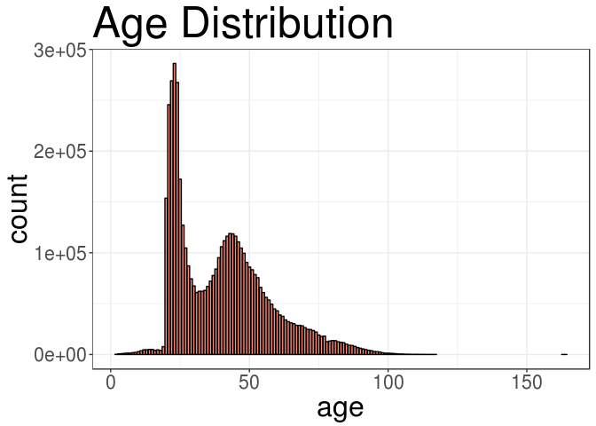

從圖形可以發現除了遺失值之外，在分佈的兩端都有一些較不合理的極端值存在。 這邊作者用了一個蠻有趣的處理方式，由於age的分佈呈現雙峰型態，因此分別把異常值修正為接近該峰的平均值。 最後再把NA插補為age的中位數。

``` r
df$age[(df$age < 18)] <- mean(df$age[(df$age >= 18) & (df$age <=30)],na.rm=TRUE)
df$age[(df$age > 100)] <- mean(df$age[(df$age >= 30) & (df$age <=100)],na.rm=TRUE)
df$age[is.na(df$age)] <- median(df$age,na.rm=TRUE)
df$age <- round(df$age)
```

重新繪製一次age的分佈圖，看起來較為正常了。

``` r
ggplot(data=df,aes(x=age)) + 
  geom_bar(alpha=0.75,fill="tomato",color="black") +
  xlim(c(18,100)) + 
  ggtitle("Age Distribution") + 
  my_theme
```

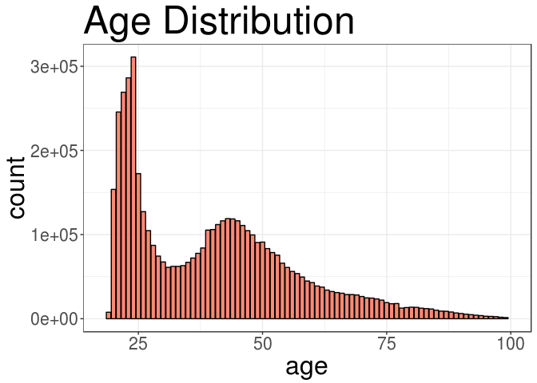

接著來看看新客戶旗標(ind\_nuevo)有多少缺漏值？

``` r
sum(is.na(df$ind_nuevo))
```

    ## [1] 10099

檢查這些客戶在這份資料中最多被記錄到幾次？也就是檢查成為該銀行客戶有多久時間(月)。

底下幾個資料整理函數都是來自dplyr套件，另外%&gt;%則是pipeline語法。

``` r
months.active <- df[is.na(df$ind_nuevo),] %>%
  group_by(ncodpers) %>%
  summarise(months.active=n())  %>%
  select(months.active)
max(months.active)
```

    ## [1] 6

發現最多也只有六個月，所以看起來這些NA都是新客戶，因此直接以1去填補。

``` r
df$ind_nuevo[is.na(df$ind_nuevo)] <- 1 
```

繼續檢查antiguedad欄位。

``` r
sum(is.na(df$antiguedad))
```

    ## [1] 10099

發現又是10099，所以很有可能跟上面那些是同一批客戶。 檢查一下這些人的ind\_nuevo作確認。

``` r
summary(df[is.na(df$antiguedad),]%>%select(ind_nuevo))
```

    ##    ind_nuevo
    ##  Min.   :1  
    ##  1st Qu.:1  
    ##  Median :1  
    ##  Mean   :1  
    ##  3rd Qu.:1  
    ##  Max.   :1

看起來是同一批人沒錯，所以這邊的NA都給定為最小資歷。 小於0的部分修正為0。

``` r
df$antiguedad[is.na(df$antiguedad)] <- min(df$antiguedad,na.rm=TRUE)
df$antiguedad[df$antiguedad<0] <- 0
```

對於沒有fecha\_alta資訊的客戶，則是直接給定中位數。

``` r
df$fecha_alta[is.na(df$fecha_alta)] <- median(df$fecha_alta,na.rm=TRUE)
```

indrel這個變數說明寫得不是很清楚，可能是代表銀行認為該客戶是否為潛力客戶的意思。 無論如何還是先看一下資料分佈。

``` r
table(df$indrel)
```

    ## 
    ##       1      99 
    ## 4975858    8972

發現比例差異懸殊，因此直接把NA指派為1。

``` r
df$indrel[is.na(df$indrel)] <- 1
```

tipodom和cod\_prov都是跟客戶地址相關的欄位，作者認為對模型應無作用所以直接刪掉了。

``` r
df <- df %>% select(-tipodom,-cod_prov)
```

怕大家還要捲回去看太麻煩，這邊再確認一次遺失值情況。

``` r
sapply(df,function(x)any(is.na(x)))
```

    ##            fecha_dato              ncodpers          ind_empleado 
    ##                 FALSE                 FALSE                 FALSE 
    ##       pais_residencia                  sexo                   age 
    ##                 FALSE                 FALSE                 FALSE 
    ##            fecha_alta             ind_nuevo            antiguedad 
    ##                 FALSE                 FALSE                 FALSE 
    ##                indrel        ult_fec_cli_1t           indrel_1mes 
    ##                 FALSE                 FALSE                 FALSE 
    ##           tiprel_1mes               indresi                indext 
    ##                 FALSE                 FALSE                 FALSE 
    ##              conyuemp         canal_entrada               indfall 
    ##                 FALSE                 FALSE                 FALSE 
    ##               nomprov ind_actividad_cliente                 renta 
    ##                 FALSE                  TRUE                  TRUE 
    ##              segmento     ind_ahor_fin_ult1     ind_aval_fin_ult1 
    ##                 FALSE                 FALSE                 FALSE 
    ##      ind_cco_fin_ult1     ind_cder_fin_ult1      ind_cno_fin_ult1 
    ##                 FALSE                 FALSE                 FALSE 
    ##     ind_ctju_fin_ult1     ind_ctma_fin_ult1     ind_ctop_fin_ult1 
    ##                 FALSE                 FALSE                 FALSE 
    ##     ind_ctpp_fin_ult1     ind_deco_fin_ult1     ind_deme_fin_ult1 
    ##                 FALSE                 FALSE                 FALSE 
    ##     ind_dela_fin_ult1     ind_ecue_fin_ult1     ind_fond_fin_ult1 
    ##                 FALSE                 FALSE                 FALSE 
    ##      ind_hip_fin_ult1     ind_plan_fin_ult1     ind_pres_fin_ult1 
    ##                 FALSE                 FALSE                 FALSE 
    ##     ind_reca_fin_ult1     ind_tjcr_fin_ult1     ind_valo_fin_ult1 
    ##                 FALSE                 FALSE                 FALSE 
    ##      ind_viv_fin_ult1       ind_nomina_ult1     ind_nom_pens_ult1 
    ##                 FALSE                  TRUE                  TRUE 
    ##       ind_recibo_ult1                 month 
    ##                 FALSE                 FALSE

計算ind\_actividad\_cliente遺失值個數。

``` r
sum(is.na(df$ind_actividad_cliente))
```

    ## [1] 10099

又是10099，代表這幾筆資料可能根本有問題，或許應該要考慮直接把這些資料刪掉。 不過作者在這邊還是先保留繼續進行清理步驟。

``` r
df$ind_actividad_cliente[is.na(df$ind_actividad_cliente)] <- median(df$ind_actividad_cliente,na.rm=TRUE)
```

看看省份名稱(nomprov)有哪些？

``` r
unique(df$nomprov)
```

    ##  [1] "CIUDAD REAL"            "ZARAGOZA"              
    ##  [3] "LEON"                   "GIRONA"                
    ##  [5] "ZAMORA"                 "SALAMANCA"             
    ##  [7] "NAVARRA"                "TOLEDO"                
    ##  [9] "BARCELONA"              "MADRID"                
    ## [11] "ALICANTE"               "VALLADOLID"            
    ## [13] "BALEARS, ILLES"         "VALENCIA"              
    ## [15] "HUESCA"                 "CORUÑA, A"             
    ## [17] "OURENSE"                "LUGO"                  
    ## [19] "BADAJOZ"                "AVILA"                 
    ## [21] "CANTABRIA"              "BURGOS"                
    ## [23] "MURCIA"                 "MALAGA"                
    ## [25] "GIPUZKOA"               "CADIZ"                 
    ## [27] "CACERES"                "ALMERIA"               
    ## [29] "PONTEVEDRA"             "GUADALAJARA"           
    ## [31] "SEGOVIA"                "CUENCA"                
    ## [33] "ALBACETE"               "TERUEL"                
    ## [35] "PALENCIA"               "RIOJA, LA"             
    ## [37] "PALMAS, LAS"            "HUELVA"                
    ## [39] "CORDOBA"                "JAEN"                  
    ## [41] "LERIDA"                 "SEVILLA"               
    ## [43] "SANTA CRUZ DE TENERIFE" "GRANADA"               
    ## [45] "BIZKAIA"                "ASTURIAS"              
    ## [47] "CASTELLON"              "MELILLA"               
    ## [49] "TARRAGONA"              "ALAVA"                 
    ## [51] "SORIA"                  ""                      
    ## [53] "CEUTA"

把空值改為UNKNOWN

``` r
df$nomprov[df$nomprov==""] <- "UNKNOWN"
```

接著檢查家戶收入(renta)的遺失值數。

``` r
sum(is.na(df$renta))
```

    ## [1] 1023049

發現缺漏比例比較高，有兩成以上。 所以我們要比較謹慎去處理，而不是直接用整組資料的中位數去作插補。

在這邊作者的處理方式也比較特別，是by不同城市別去檢視renta的中位數。 而且畫圖還很無聊特地用了一個西班牙國旗的配色。

``` r
df %>%
  filter(!is.na(renta)) %>%
  group_by(nomprov) %>%
  summarise(med.income = median(renta)) %>%
  arrange(med.income) %>%
  mutate(city=factor(nomprov,levels=nomprov)) %>% # the factor() call prevents reordering the names
  ggplot(aes(x=city,y=med.income)) + 
  geom_point(color="#c60b1e") + 
  guides(color=FALSE) + 
  xlab("City") +
  ylab("Median Income") +  
  my_theme + 
  theme(axis.text.x=element_blank(), axis.ticks = element_blank()) + 
  geom_text(aes(x=city,y=med.income,label=city),angle=90,hjust=-.25) +
  theme(plot.background=element_rect(fill="#c60b1e"),
        panel.background=element_rect(fill="#ffc400"),
        panel.grid =element_blank(),
        axis.title =element_text(color="#ffc400"),
        axis.text  =element_text(color="#ffc400"),
        plot.title =element_text(color="#ffc400",size=32)) +
  ylim(c(50000,200000)) +
  ggtitle("Income Distribution by City")
```

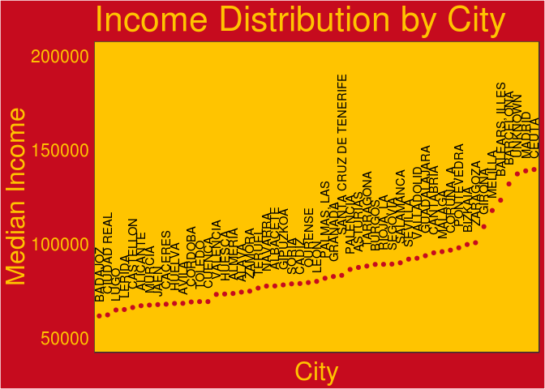

看起來不同城市間的renta值確實有差異，因此renta的NA值就by城市的中位數去作插補。

``` r
new.incomes <-df %>%
  select(nomprov) %>%
  merge(df %>%
          group_by(nomprov) %>%
          summarise(med.income=median(renta,na.rm=TRUE)),by="nomprov") %>%
  select(nomprov,med.income) %>%
  arrange(nomprov)
df <- arrange(df,nomprov)
df$renta[is.na(df$renta)] <- new.incomes$med.income[is.na(df$renta)]
rm(new.incomes)
```

由於某些城市的renta值全都是NA，因此最後還要再插補一次。

``` r
df$renta[is.na(df$renta)] <- median(df$renta,na.rm=TRUE)
df <- arrange(df,fecha_dato)
```

檢查ind\_nomina\_ult1的遺失值數。

``` r
sum(is.na(df$ind_nomina_ult1))
```

    ## [1] 5750

這個欄位是產品持有的旗標，比較好的作法可能是回頭看前幾個月的產品持有情況去判斷，但由於缺漏比例蠻小的而且作者也懶惰，所以就直接全部補0了。

``` r
df[is.na(df)] <- 0
```

到目前為止我們已經把NA的情況都處理掉了，但是可能會有一些字串型態變數的缺漏值是以空字串作表示，所以接下來檢查一下有沒這種情況。

``` r
str(df)
```

    ## 'data.frame':    4994929 obs. of  47 variables:
    ##  $ fecha_dato           : POSIXct, format: "2015-01-28" "2015-01-28" ...
    ##  $ ncodpers             : int  1049129 1052813 1054808 1043828 1043931 1064079 1067230 1059828 1058036 1058355 ...
    ##  $ ind_empleado         : chr  "N" "N" "N" "N" ...
    ##  $ pais_residencia      : chr  "ES" "ES" "ES" "ES" ...
    ##  $ sexo                 : chr  "H" "H" "H" "V" ...
    ##  $ age                  : num  27 26 24 27 23 46 25 49 24 22 ...
    ##  $ fecha_alta           : POSIXct, format: "2012-08-09" "2012-08-20" ...
    ##  $ ind_nuevo            : num  0 0 0 0 0 0 0 0 0 0 ...
    ##  $ antiguedad           : num  35 35 35 35 35 34 34 34 34 34 ...
    ##  $ indrel               : num  1 1 1 1 1 1 1 1 1 1 ...
    ##  $ ult_fec_cli_1t       : chr  "" "" "" "" ...
    ##  $ indrel_1mes          : chr  "1" "1" "1" "1" ...
    ##  $ tiprel_1mes          : chr  "I" "I" "I" "I" ...
    ##  $ indresi              : chr  "S" "S" "S" "S" ...
    ##  $ indext               : chr  "N" "N" "N" "N" ...
    ##  $ conyuemp             : chr  "" "" "" "" ...
    ##  $ canal_entrada        : chr  "KHE" "KHE" "KHE" "KHE" ...
    ##  $ indfall              : chr  "N" "N" "N" "N" ...
    ##  $ nomprov              : chr  "ALAVA" "ALAVA" "ALAVA" "ALAVA" ...
    ##  $ ind_actividad_cliente: num  1 0 0 0 1 1 1 1 0 1 ...
    ##  $ renta                : num  74454 74454 74454 74454 74454 ...
    ##  $ segmento             : chr  "03 - UNIVERSITARIO" "03 - UNIVERSITARIO" "03 - UNIVERSITARIO" "03 - UNIVERSITARIO" ...
    ##  $ ind_ahor_fin_ult1    : int  0 0 0 0 0 0 0 0 0 0 ...
    ##  $ ind_aval_fin_ult1    : int  0 0 0 0 0 0 0 0 0 0 ...
    ##  $ ind_cco_fin_ult1     : int  1 1 1 1 1 1 0 1 1 1 ...
    ##  $ ind_cder_fin_ult1    : int  0 0 0 0 0 0 0 0 0 0 ...
    ##  $ ind_cno_fin_ult1     : int  0 0 0 0 0 0 1 0 0 0 ...
    ##  $ ind_ctju_fin_ult1    : int  0 0 0 0 0 0 0 0 0 0 ...
    ##  $ ind_ctma_fin_ult1    : int  0 0 0 0 0 0 0 0 0 0 ...
    ##  $ ind_ctop_fin_ult1    : int  0 0 0 0 0 0 0 0 0 0 ...
    ##  $ ind_ctpp_fin_ult1    : int  0 0 0 0 0 0 0 0 0 0 ...
    ##  $ ind_deco_fin_ult1    : int  0 0 0 0 0 0 0 0 0 0 ...
    ##  $ ind_deme_fin_ult1    : int  0 0 0 0 0 0 0 0 0 0 ...
    ##  $ ind_dela_fin_ult1    : int  0 0 0 0 0 1 0 0 0 0 ...
    ##  $ ind_ecue_fin_ult1    : int  0 0 0 0 0 1 0 0 0 0 ...
    ##  $ ind_fond_fin_ult1    : int  0 0 0 0 0 0 0 0 0 0 ...
    ##  $ ind_hip_fin_ult1     : int  0 0 0 0 0 0 0 0 0 0 ...
    ##  $ ind_plan_fin_ult1    : int  0 0 0 0 0 0 0 0 0 0 ...
    ##  $ ind_pres_fin_ult1    : int  0 0 0 0 0 0 0 0 0 0 ...
    ##  $ ind_reca_fin_ult1    : int  0 0 0 0 0 0 0 0 0 0 ...
    ##  $ ind_tjcr_fin_ult1    : int  0 0 0 0 0 0 0 0 0 0 ...
    ##  $ ind_valo_fin_ult1    : int  0 0 0 0 0 0 0 0 0 0 ...
    ##  $ ind_viv_fin_ult1     : int  0 0 0 0 0 0 0 0 0 0 ...
    ##  $ ind_nomina_ult1      : num  0 0 0 0 0 0 0 0 0 0 ...
    ##  $ ind_nom_pens_ult1    : num  0 0 0 0 0 0 0 0 0 0 ...
    ##  $ ind_recibo_ult1      : int  0 0 0 0 0 0 1 0 0 0 ...
    ##  $ month                : num  1 1 1 1 1 1 1 1 1 1 ...
    ##  - attr(*, ".internal.selfref")=<externalptr>

重新format一下只看unique的部分。

``` r
char.cols <- names(df)[sapply(df,is.character)]
for (name in char.cols){
  print(sprintf("Unique values for %s:", name))
  print(unique(df[[name]]))
  cat('\n')
}
```

    ## [1] "Unique values for ind_empleado:"
    ## [1] "N" "B" "F" "A" "S" "" 
    ## 
    ## [1] "Unique values for pais_residencia:"
    ##  [1] "ES" "PY" "IT" "BO" ""   "CL" "AT" "NL" "GB" "DO" "US" "FR" "BR" "PE"
    ## [15] "MX" "PT" "FI" "CO" "CN" "PL" "IN" "CH" "NI" "HN" "BE" "DE" "RO" "IL"
    ## [29] "GT" "RU" "MA" "NO" "SN" "BG" "GR" "AR" "EE" "CZ" "IE" "EC" "HK" "UA"
    ## [43] "VE" "BY" "KE" "SG" "CA" "MD" "AU" "TR" "AO" "CU" "PR" "ZA" "PA" "DK"
    ## [57] "UY" "GE" "CM" "SE" "DZ" "JP" "CR" "PK" "QA" "SA" "SK" "LU" "AE" "AD"
    ## [71] "RS" "VN" "TH" "EG" "NZ" "NG" "GN" "GW" "SV" "KR" "ET" "GA" "GQ" "TW"
    ## [85] "LT" "LY" "BA" "MR" "KZ" "BZ" "DJ" "OM" "HU"
    ## 
    ## [1] "Unique values for sexo:"
    ## [1] "H" "V" "" 
    ## 
    ## [1] "Unique values for ult_fec_cli_1t:"
    ##   [1] ""           "2015-07-09" "2015-07-06" "2015-07-13" "2015-07-07"
    ##   [6] "2015-07-28" "2015-07-22" "2015-07-17" "2015-07-10" "2015-07-24"
    ##  [11] "2015-07-08" "2015-07-30" "2015-07-21" "2015-07-29" "2015-07-15"
    ##  [16] "2015-07-14" "2015-07-03" "2015-07-20" "2015-07-01" "2015-07-23"
    ##  [21] "2015-07-02" "2015-07-16" "2015-07-27" "2015-08-12" "2015-08-14"
    ##  [26] "2015-08-28" "2015-08-07" "2015-08-06" "2015-08-26" "2015-08-27"
    ##  [31] "2015-08-25" "2015-08-18" "2015-08-24" "2015-08-20" "2015-08-19"
    ##  [36] "2015-08-05" "2015-08-04" "2015-08-11" "2015-08-10" "2015-08-21"
    ##  [41] "2015-08-13" "2015-08-17" "2015-08-03" "2015-09-01" "2015-09-14"
    ##  [46] "2015-09-24" "2015-09-04" "2015-09-15" "2015-09-17" "2015-09-03"
    ##  [51] "2015-09-16" "2015-09-18" "2015-09-08" "2015-09-23" "2015-09-09"
    ##  [56] "2015-09-28" "2015-09-29" "2015-09-22" "2015-09-02" "2015-09-21"
    ##  [61] "2015-09-11" "2015-09-25" "2015-09-07" "2015-09-10" "2015-10-08"
    ##  [66] "2015-10-13" "2015-10-16" "2015-10-07" "2015-10-22" "2015-10-15"
    ##  [71] "2015-10-01" "2015-10-23" "2015-10-05" "2015-10-02" "2015-10-27"
    ##  [76] "2015-10-28" "2015-10-19" "2015-10-21" "2015-10-26" "2015-10-06"
    ##  [81] "2015-10-09" "2015-10-20" "2015-10-14" "2015-10-29" "2015-11-12"
    ##  [86] "2015-11-13" "2015-11-24" "2015-11-18" "2015-11-25" "2015-11-16"
    ##  [91] "2015-11-02" "2015-11-23" "2015-11-26" "2015-11-09" "2015-11-11"
    ##  [96] "2015-11-19" "2015-11-10" "2015-11-06" "2015-11-27" "2015-11-04"
    ## [101] "2015-11-20" "2015-11-03" "2015-11-05" "2015-11-17" "2015-12-10"
    ## [106] "2015-12-03" "2015-12-22" "2015-12-16" "2015-12-24" "2015-12-17"
    ## [111] "2015-12-29" "2015-12-21" "2015-12-28" "2015-12-30" "2015-12-18"
    ## [116] "2015-12-02" "2015-12-09" "2015-12-14" "2015-12-01" "2015-12-11"
    ## [121] "2015-12-15" "2015-12-07" "2015-12-23" "2015-12-04" "2016-01-19"
    ## [126] "2016-01-21" "2016-01-15" "2016-01-11" "2016-01-26" "2016-01-18"
    ## [131] "2016-01-08" "2016-01-12" "2016-01-05" "2016-01-13" "2016-01-07"
    ## [136] "2016-01-28" "2016-01-04" "2016-01-14" "2016-01-25" "2016-01-27"
    ## [141] "2016-01-22" "2016-01-20" "2016-02-02" "2016-02-22" "2016-02-24"
    ## [146] "2016-02-18" "2016-02-01" "2016-02-19" "2016-02-17" "2016-02-08"
    ## [151] "2016-02-09" "2016-02-15" "2016-02-12" "2016-02-23" "2016-02-25"
    ## [156] "2016-02-26" "2016-02-10" "2016-02-03" "2016-02-16" "2016-02-11"
    ## [161] "2016-02-05" "2016-02-04" "2016-03-22" "2016-03-11" "2016-03-09"
    ## [166] "2016-03-02" "2016-03-01" "2016-03-21" "2016-03-16" "2016-03-15"
    ## [171] "2016-03-18" "2016-03-10" "2016-03-14" "2016-03-30" "2016-03-23"
    ## [176] "2016-03-29" "2016-03-04" "2016-03-17" "2016-03-03" "2016-03-08"
    ## [181] "2016-03-24" "2016-03-28" "2016-03-07" "2016-04-04" "2016-04-06"
    ## [186] "2016-04-12" "2016-04-15" "2016-04-11" "2016-04-01" "2016-04-20"
    ## [191] "2016-04-28" "2016-04-08" "2016-04-22" "2016-04-26" "2016-04-27"
    ## [196] "2016-04-07" "2016-04-25" "2016-04-19" "2016-04-05" "2016-04-18"
    ## [201] "2016-04-13" "2016-04-14" "2016-04-21" "2016-05-09" "2016-05-11"
    ## [206] "2016-05-23" "2016-05-24" "2016-05-02" "2016-05-18" "2016-05-19"
    ## [211] "2016-05-17" "2016-05-16" "2016-05-20" "2016-05-25" "2016-05-06"
    ## [216] "2016-05-05" "2016-05-04" "2016-05-27" "2016-05-26" "2016-05-13"
    ## [221] "2016-05-30" "2016-05-12" "2016-05-03" "2016-05-10"
    ## 
    ## [1] "Unique values for indrel_1mes:"
    ##  [1] "1"   "3"   ""    "1.0" "3.0" "P"   "4"   "2"   "2.0" "4.0"
    ## 
    ## [1] "Unique values for tiprel_1mes:"
    ## [1] "I" "A" "P" ""  "R"
    ## 
    ## [1] "Unique values for indresi:"
    ## [1] "S" "N" "" 
    ## 
    ## [1] "Unique values for indext:"
    ## [1] "N" "S" "" 
    ## 
    ## [1] "Unique values for conyuemp:"
    ## [1] ""  "N"
    ## 
    ## [1] "Unique values for canal_entrada:"
    ##   [1] "KHE" "KAT" "KFC" "KHD" "KAZ" "KHC" "KFA" "KHK" "KHM" "RED" "KAY"
    ##  [12] "KAI" "KEZ" "KAC" "007" "KAQ" "KCH" "KGY" "KGX" "KAE" "KEY" "KBO"
    ##  [23] "013" "KCC" "KAP" "KEN" "KDW" "KEH" "KAR" "KAG" "KEW" "KAS" "KAA"
    ##  [34] "KHL" "KFU" "KFI" "KDI" "KEL" "KBZ" "KAF" "KDR" "KHF" "KCG" "KES"
    ##  [45] "KDZ" "KAB" "KCM" "KDS" "KAD" "KAW" "KFH" "KAM" "KAJ" "KEO" "KFD"
    ##  [56] "KFG" "KDM" "KAO" "KFJ" "KBJ" "KFK" "KGV" "KFS" "KFF" "KAH" "KBQ"
    ##  [67] "KCK" "KCD" "KEB" "KBH" "KAL" "KCI" "KFP" "KBF" "KAK" "KBM" "KBG"
    ##  [78] "KCF" "KHA" "KFN" ""    "KDE" "KDA" "KDC" "KBU" "KCS" "KCV" "KCU"
    ##  [89] "KDX" "KCX" "KDG" "KDF" "KEF" "KCB" "KEV" "KAU" "KDT" "KAN" "KCN"
    ## [100] "KFR" "KFL" "KED" "KEE" "KEM" "KHN" "KGW" "KEI" "KCA" "KEJ" "KDQ"
    ## [111] "KFT" "KDY" "KEQ" "KDN" "KCJ" "KEU" "KFM" "KEC" "KCL" "KDD" "KCE"
    ## [122] "KBL" "KDU" "KCO" "KBR" "KBV" "KBY" "KBD" "KBW" "KBX" "KBS" "KBE"
    ## [133] "KBP" "KBB" "004" "KGU" "KFB" "KEG" "KCR" "K00" "KDO" "KEA" "KDP"
    ## [144] "KAV" "KEK" "KBN" "KDV" "KFE" "KCP" "KCQ" "KHO" "KCT" "KDH" "KGC"
    ## [155] "KFV" "025" "KHQ" "KHP" "KHS"
    ## 
    ## [1] "Unique values for indfall:"
    ## [1] "N" "S" "" 
    ## 
    ## [1] "Unique values for nomprov:"
    ##  [1] "ALAVA"                  "ALBACETE"              
    ##  [3] "ALICANTE"               "ALMERIA"               
    ##  [5] "ASTURIAS"               "AVILA"                 
    ##  [7] "BADAJOZ"                "BALEARS, ILLES"        
    ##  [9] "BARCELONA"              "BIZKAIA"               
    ## [11] "BURGOS"                 "CACERES"               
    ## [13] "CADIZ"                  "CANTABRIA"             
    ## [15] "CASTELLON"              "CEUTA"                 
    ## [17] "CIUDAD REAL"            "CORDOBA"               
    ## [19] "CORUÑA, A"              "CUENCA"                
    ## [21] "GIPUZKOA"               "GIRONA"                
    ## [23] "GRANADA"                "GUADALAJARA"           
    ## [25] "HUELVA"                 "HUESCA"                
    ## [27] "JAEN"                   "LEON"                  
    ## [29] "LERIDA"                 "LUGO"                  
    ## [31] "MADRID"                 "MALAGA"                
    ## [33] "MELILLA"                "MURCIA"                
    ## [35] "NAVARRA"                "OURENSE"               
    ## [37] "PALENCIA"               "PALMAS, LAS"           
    ## [39] "PONTEVEDRA"             "RIOJA, LA"             
    ## [41] "SALAMANCA"              "SANTA CRUZ DE TENERIFE"
    ## [43] "SEGOVIA"                "SEVILLA"               
    ## [45] "SORIA"                  "TARRAGONA"             
    ## [47] "TERUEL"                 "TOLEDO"                
    ## [49] "UNKNOWN"                "VALENCIA"              
    ## [51] "VALLADOLID"             "ZAMORA"                
    ## [53] "ZARAGOZA"              
    ## 
    ## [1] "Unique values for segmento:"
    ## [1] "03 - UNIVERSITARIO" "02 - PARTICULARES"  "01 - TOP"          
    ## [4] ""

接下來插補的部分，就只是單純依照該欄位定義，選擇一個最有可能的值填進去，或是直接指派為UNKNOWN。

``` r
df$indfall[df$indfall==""] <- "N"
df$tiprel_1mes[df$tiprel_1mes==""] <- "A"
df$indrel_1mes[df$indrel_1mes==""] <- "1"
df$indrel_1mes[df$indrel_1mes=="P"] <- "5" # change to just numbers because it currently contains letters and numbers
df$indrel_1mes <- as.factor(as.integer(df$indrel_1mes))
df$pais_residencia[df$pais_residencia==""] <- "UNKNOWN"
df$sexo[df$sexo==""] <- "UNKNOWN"
df$ult_fec_cli_1t[df$ult_fec_cli_1t==""] <- "UNKNOWN"
df$ind_empleado[df$ind_empleado==""] <- "UNKNOWN"
df$indext[df$indext==""] <- "UNKNOWN"
df$indresi[df$indresi==""] <- "UNKNOWN"
df$conyuemp[df$conyuemp==""] <- "UNKNOWN"
df$segmento[df$segmento==""] <- "UNKNOWN"
```

將所有產品持有旗標欄位(ind\_開頭)轉為數值型態，然後新增一個total.services欄位，計算該客戶持有的產品總數。

``` r
features <- grepl("ind_+.*ult.*",names(df))
df[,features] <- lapply(df[,features],function(x)as.integer(round(x)))
df$total.services <- rowSums(df[,features],na.rm=TRUE)
```

接下來其實已經不算是單純的資料清理，而是作者為了後續分析目的，要去計算每個客戶在不同月份間的產品持有狀態改變情形，例如某客戶在這個月份是新持有信用卡？還是在這個月之前就已持有信用卡？還是在這個月退卡？

為了達到這個目的，作者新增了兩個指標變數識別日期的先後期數。 這邊使用的技巧是將日期排序後先轉factor再轉numeric，這樣該變數就會變成1,2,3,...

``` r
df <- df %>% arrange(fecha_dato)
df$month.id <- as.numeric(factor((df$fecha_dato)))
df$month.next.id <- df$month.id + 1
```

自訂函數計算該月產品持有狀態(Added, Maintained, Dropped)。

``` r
status.change <- function(x){
  if ( length(x) == 1 ) { # if only one entry exists, I'll assume they are a new customer and therefore are adding services
    label = ifelse(x==1,"Added","Maintained")
  } else {
    diffs <- diff(x) # difference month-by-month
    diffs <- c(0,diffs) # first occurrence will be considered Maintained, which is a little lazy. A better way would be to check if the earliest date was the same as the earliest we have in the dataset and consider those separately. Entries with earliest dates later than that have joined and should be labeled as "Added"
    label <- rep("Maintained", length(x))
    label <- ifelse(diffs==1,"Added",
                    ifelse(diffs==-1,"Dropped",
                           "Maintained"))
  }
  label
}

df[,features] <- lapply(df[,features], function(x) return(ave(x,df$ncodpers, FUN=status.change)))
```

最後，由於我們感興趣的是產品Added跟Dropped的情況，再加上後續要進行資料變型的時候會很耗計算時間資源，所以直接先把Maintained的情況都刪掉。

利用tidyr套件的gather函數將寬型資料轉為長型資料，也就是每一筆資料只包含一個客戶在單個月份的單項產品狀態。

``` r
interesting <- rowSums(df[,features]!="Maintained")
df <- df[interesting>0,]
df <- df %>%
  gather(key=feature,
         value=status,
         ind_ahor_fin_ult1:ind_recibo_ult1)
df <- filter(df,status!="Maintained")
head(df)
```

    ##   fecha_dato ncodpers ind_empleado pais_residencia sexo age fecha_alta
    ## 1 2015-02-28    53273            N              ES    V  43 2000-04-06
    ## 2 2015-05-28   186769            N              ES    V  49 2000-08-03
    ## 3 2015-06-28   194160            N              ES    H  41 2000-09-25
    ## 4 2015-12-28   241755            N              ES    H  44 2001-04-23
    ## 5 2016-01-28   331690            N              ES    H  54 2002-02-18
    ## 6 2016-05-28   194160            N              ES    H  42 2000-09-25
    ##   ind_nuevo antiguedad indrel ult_fec_cli_1t indrel_1mes tiprel_1mes
    ## 1         0        183      1        UNKNOWN           1           A
    ## 2         0        180      1        UNKNOWN           1           A
    ## 3         0        178      1        UNKNOWN           1           A
    ## 4         0        186     99     2015-12-16           1           I
    ## 5         0        167      1        UNKNOWN           1           A
    ## 6         0        188      1        UNKNOWN           1           A
    ##   indresi indext conyuemp canal_entrada indfall   nomprov
    ## 1       S      N  UNKNOWN           KAT       N BARCELONA
    ## 2       S      N  UNKNOWN           KAT       N    MADRID
    ## 3       S      N  UNKNOWN           KAT       N    MADRID
    ## 4       S      N  UNKNOWN           KAT       N    MURCIA
    ## 5       S      N  UNKNOWN           KAE       N  VALENCIA
    ## 6       S      N  UNKNOWN           KAT       N    MADRID
    ##   ind_actividad_cliente     renta          segmento month total.services
    ## 1                     1 121920.30          01 - TOP     2              6
    ## 2                     1 138778.59          01 - TOP     5              8
    ## 3                     1 338502.75 02 - PARTICULARES     6              1
    ## 4                     0  67548.93 02 - PARTICULARES    12              0
    ## 5                     1  47671.47          01 - TOP     1              5
    ## 6                     1 338502.75 02 - PARTICULARES     5              3
    ##   month.id month.next.id           feature  status
    ## 1        2             3 ind_ahor_fin_ult1   Added
    ## 2        5             6 ind_ahor_fin_ult1 Dropped
    ## 3        6             7 ind_ahor_fin_ult1 Dropped
    ## 4       12            13 ind_ahor_fin_ult1 Dropped
    ## 5       13            14 ind_ahor_fin_ult1 Dropped
    ## 6       17            18 ind_ahor_fin_ult1   Added

Data Visualizations
-------------------

``` r
totals.by.feature <- df %>%
  group_by(month,feature) %>%
  summarise(counts=n())
```

``` r
df %>% 
  group_by(month,feature,status) %>%
  summarise(counts=n())%>%
  ungroup() %>%
  inner_join(totals.by.feature,by=c("month","feature")) %>%
  
  mutate(counts=counts.x/counts.y) %>%
  ggplot(aes(y=counts,x=factor(month.abb[month],levels=month.abb[seq(12,1,-1)]))) +
  geom_bar(aes(fill=status), stat="identity") +
  facet_wrap(facets=~feature,ncol = 6) +
  coord_flip() +
  my_theme_dark + 
  ylab("Count") +
  xlab("") + 
  ylim(limits=c(0,1)) +
  ggtitle("Relative Service \nChanges by Month") +
  theme(axis.text   = element_text(size=10),
        legend.text = element_text(size=14),
        legend.title= element_blank()      ,
        strip.text  = element_text(face="bold")) +
  scale_fill_manual(values=c("cyan","magenta"))
```

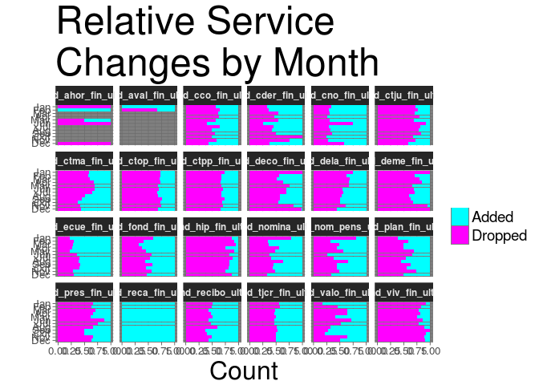

``` r
month.counts <- table(unique(df$month.id)%%12)
cur.names <- names(month.counts)
cur.names[cur.names=="0"] <- "12"
names(month.counts) <- cur.names
month.counts <- data.frame(month.counts) %>%
  rename(month=Var1,month.count=Freq) %>% mutate(month=as.numeric(month))
```

``` r
df %>% 
  group_by(month,feature,status) %>%
  summarise(counts=n())%>%
  ungroup() %>%
  inner_join(month.counts,by="month") %>%
  
  mutate(counts=counts/month.count) %>%
  ggplot(aes(y=counts,x=factor(month.abb[month],levels=month.abb[seq(12,1,-1)]))) +
  geom_bar(aes(fill=status), stat="identity") +
  facet_wrap(facets=~feature,ncol = 6) +
  coord_flip() +
  my_theme_dark + 
  ylab("Count") +
  xlab("") + 
  ggtitle("Average Service \nChanges by Month") +
  theme(axis.text    = element_text(size=10),
        legend.text  = element_text(size=14),
        legend.title = element_blank()      ,
        strip.text   = element_text(face="bold")) +
  scale_fill_manual(values=c("cyan","magenta"))
```

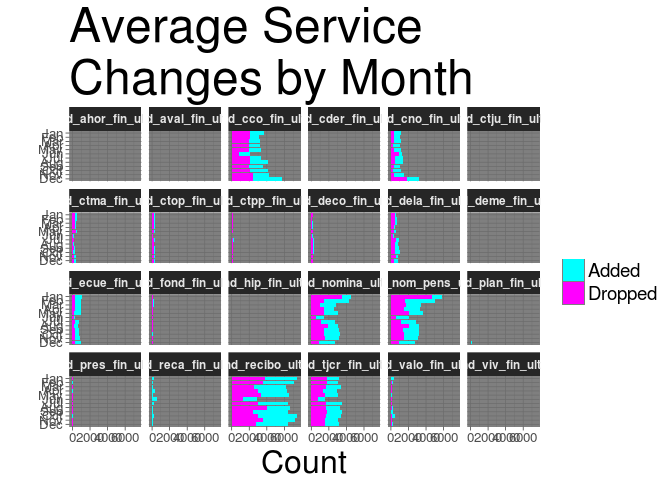

``` r
df %>%
  filter(sexo!="UNKNOWN") %>%
  ggplot(aes(x=sexo)) +
  geom_bar(aes(fill=status)) +
  facet_wrap(facets=~feature,ncol = 6) +
  my_theme_dark + 
  ylab("Count") +
  xlab("") +
  ggtitle("Service Changes by Gender") +
  theme(axis.text    = element_text(size=10),
        legend.text  = element_text(size=14),
        legend.title = element_blank()      ,
        strip.text   = element_text(face="bold")) +
  scale_fill_manual(values=c("cyan","magenta"))
```

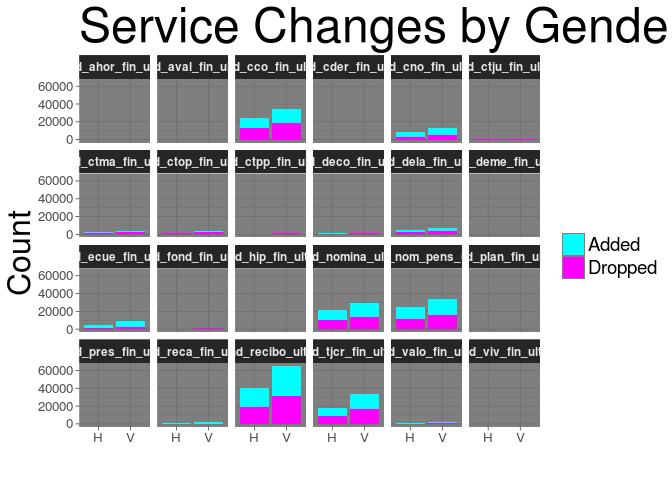

``` r
tot.H  <- sum(df$sexo=="H")
tot.V  <- sum(df$sexo=="V")
tmp.df <- df %>%
  group_by(sexo,status) %>%
  summarise(counts=n())
tmp.df$counts[tmp.df$sexo=="H"] = tmp.df$counts[tmp.df$sexo=="H"] / tot.H
tmp.df$counts[tmp.df$sexo=="V"] = tmp.df$counts[tmp.df$sexo=="V"] / tot.V
tmp.df %>%
  filter(sexo!="UNKNOWN") %>%
  ggplot(aes(x=factor(feature),y=counts)) +
  geom_bar(aes(fill=status,sexo),stat='identity') +
  coord_flip() +
  my_theme_dark + 
  ylab("Ratio") +
  xlab("") +
  ggtitle("Normalized Service \n Changes by Gender") +
  theme(axis.text    = element_text(size=20),
        legend.text  = element_text(size=14),
        legend.title = element_blank()      ,
        strip.text   = element_text(face="bold")) +
  scale_fill_manual(values=c("cyan","magenta"))
```

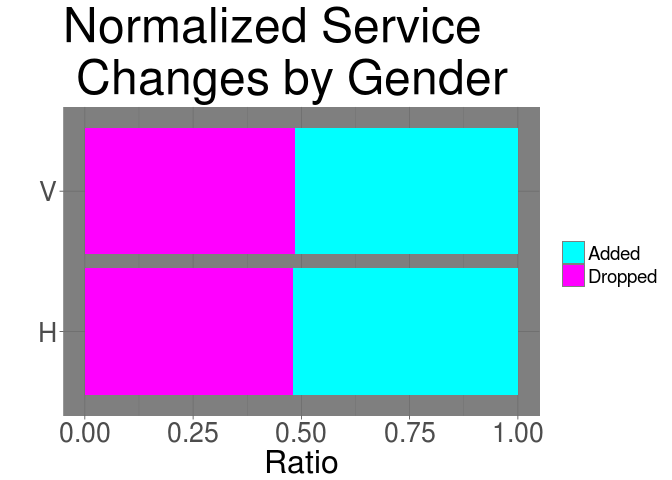

``` r
rm(tmp.df)
```

``` r
tot.new     <- sum(df$ind_nuevo==1)
tot.not.new <- sum(df$ind_nuevo!=1)
tmp.df      <- df %>%
  group_by(ind_nuevo,status) %>%
  summarise(counts=n())
tmp.df$counts[tmp.df$ind_nuevo==1] = tmp.df$counts[tmp.df$ind_nuevo==1] / tot.new
tmp.df$counts[tmp.df$ind_nuevo!=1] = tmp.df$counts[tmp.df$ind_nuevo!=1] / tot.not.new
tmp.df %>%
  ggplot(aes(x=factor(feature),y=counts)) +
  geom_bar(aes(fill=status,factor(ind_nuevo)),stat='identity') +
  coord_flip() +
  my_theme_dark + 
  ylab("Count") +
  xlab("") +
  ggtitle("Normalized Service \n Changes by New Status") +
  theme(axis.text    = element_text(size=10),
        legend.text  = element_text(size=14),
        legend.title = element_blank()      ,
        strip.text   = element_text(face="bold")) +
  scale_fill_manual(values=c("cyan","magenta"))
```

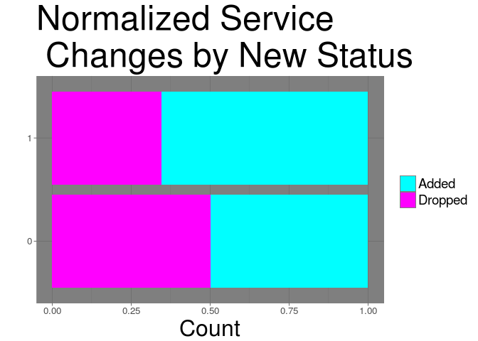

``` r
rm(tmp.df)
```

``` r
df %>%
  group_by(nomprov,status) %>%
  summarise(y=mean(total.services)) %>%
  ggplot(aes(x=factor(nomprov,levels=sort(unique(nomprov),decreasing=TRUE)),y=y)) +
  geom_bar(stat="identity",aes(fill=status)) +
  geom_text(aes(label=nomprov),
            y=0.2,
            hjust=0,
            angle=0,
            size=3,
            color="#222222") +
  coord_flip() +
  my_theme_dark +
  xlab("City") +
  ylab("Total # Changes") + 
  ggtitle("Service Changes\n by City") +
  theme(axis.text    = element_blank(),
        legend.text  = element_text(size=14),
        legend.title = element_text(size=18)) +
  scale_fill_manual(values=c("cyan","magenta"))
```

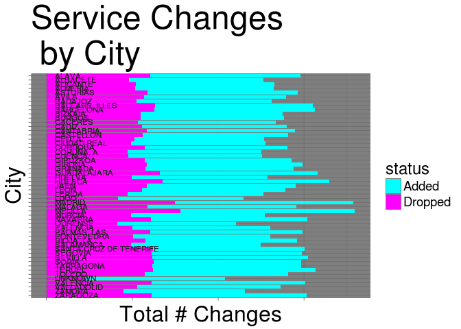

``` r
df %>%
  group_by(antiguedad,status) %>%
  summarise(counts=n()) %>%
  ggplot(aes(x=factor(antiguedad),y=log(counts))) +
  geom_point(alpha=0.6,aes(color=status)) +
  my_theme_dark +
  xlab("Seniority (Months)") +
  ylab("Total # Changes") + 
  ggtitle("Service Changes \n by Seniority") +
  theme(axis.text    = element_blank(),
        legend.text  = element_text(size=14),
        legend.title = element_text(size=18)) +
  scale_color_manual(values=c("cyan","magenta"))
```

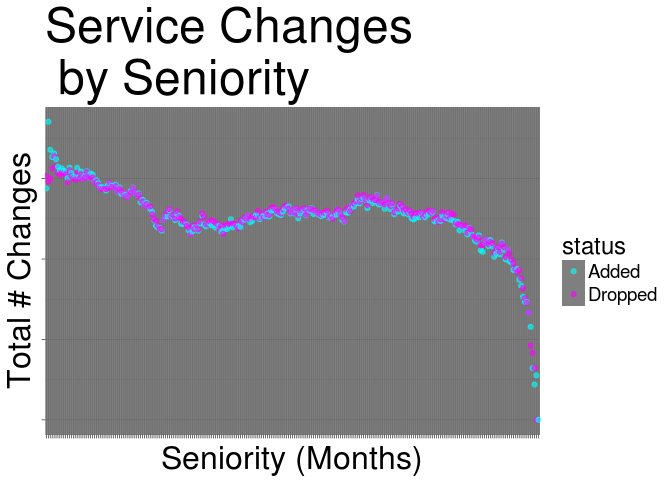

``` r
df %>%
  ggplot(aes(x=age,y=log(renta))) +
  geom_point(alpha=0.5,aes(color=status)) +
  my_theme_dark +
  xlab("Age") +
  ylab("Income (log scale)") + 
  ggtitle("Income vs. Age") +
  theme(
    legend.text  = element_text(size=14),
    legend.title = element_text(size=18)) +
  scale_color_manual(values=c("cyan","magenta"))
```

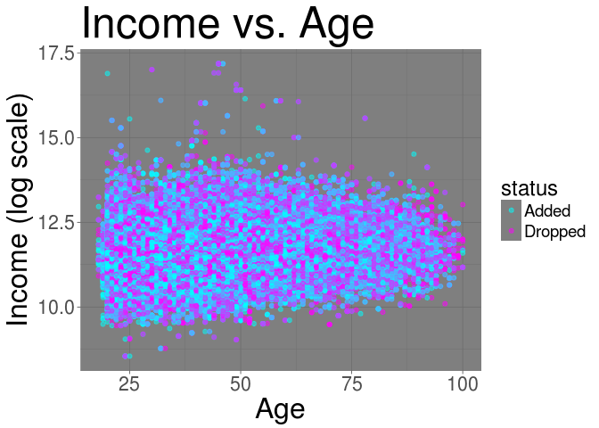

``` r
df %>%
  group_by(ncodpers) %>%
  summarise(age=max(age),seniority=max(antiguedad)) %>%
  select(age,seniority) %>%
  ggplot(aes(x=age,y=seniority)) +
  geom_point(alpha=0.4) +
  ggtitle("Seniority vs. Age") + 
  my_theme
```

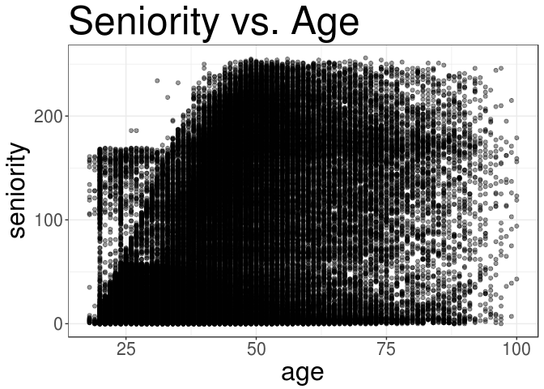

``` r
df %>%
  group_by(nomprov,status) %>%
  summarise(y=mean(total.services)) %>%
  ggplot(aes(x=factor(nomprov,levels=sort(unique(nomprov),decreasing=TRUE)),y=y)) +
  geom_bar(stat="identity",aes(fill=status)) +
  geom_text(aes(label=nomprov),
            y=0.2,
            hjust=0,
            angle=0,
            size=3,
            color="#222222") +
  coord_flip() +
  my_theme_dark +
  xlab("City") +
  ylab("Total # Changes") + 
  ggtitle("Service Changes\n by City") +
  theme(axis.text    = element_blank(),
        legend.text  = element_text(size=14),
        legend.title = element_text(size=18)) +
  scale_fill_manual(values=c("cyan","magenta"))
```


